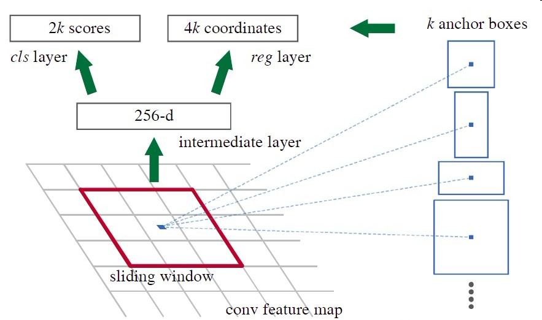
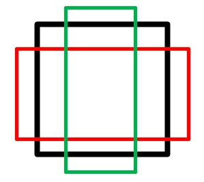
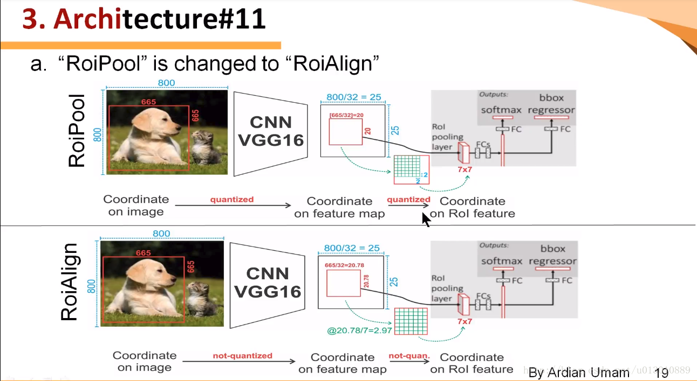
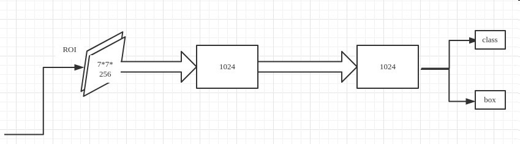
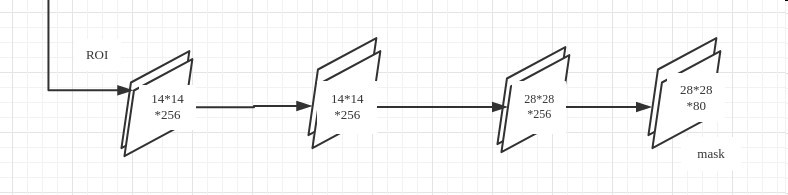
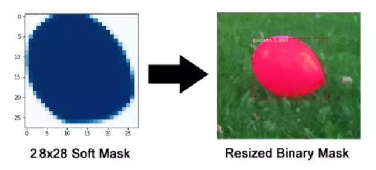

# Mask R-CNN for Object Detection and Segmentation

基于深度神经网络**Mask R-CNN**，使用TensorFlow实现。

感谢何凯明等人完成的惊人成就，论文传送门：[Mask R-CNN]( https://arxiv.org/abs/1703.06870)

## Demo

- balloon分割
- 矿物显微图像的实例分割
- **基于CT扫描的土石混合体图像的精准分割**

## 环境

- tensorflow==1.15.0
- numpy==1.17.4
- scipy
- pillow
- cython
- matplotlib
- scikit-image==0.16.2
- keras==2.1.5
- opencv-python
- h5py==2.10
- imgaug
- pyqt5
- labelme
- PyYAML
- pycocotools

## Mask R-CNN 架构分解

### 整体网络结构

### 主干特征提取网络

主干网络是一个**残差神经网络**（ ResNet50 和 ResNet101），作为**特征提取器**。

ResNet101有两个基本的块，**分别名为Conv Block和Identity Block，其中Conv Block输入和输出的维度是不一样的，所以不能连续串联，它的作用是改变网络的维度；Identity Block输入维度和输出维度相同，可以串联，用于加深网络的。**

- **Conv Block**：

- **Identity Block**：

### 特征金字塔FPN

特征金字塔FPN的构建是为了实现特征**多尺度的融合**，可以在多个尺度上更好地表征目标。在Mask R-CNN当中，我们取出在主干特征提取网络中长宽压缩了两次C2、三次C3、四次C4、五次C5的结果来进行特征金字塔结构的构造。

## 区域建议网络（RPN）

RPN 是一个轻量的神经网络，它用滑动窗口来扫描图像，并寻找存在目标的区域。RPN 扫描的区域被称为 **anchor**。

RPN用于帮助网络推荐感兴趣的区域，也是Faster-RCNN中重要的一部分。

## ROI  Align

Mask-RCNN中提出了一个新的idea就是RoIAlign，其实RoIAlign就是在RoI pooling上稍微改动过来的，但是为什么在模型中不能使用RoI pooling呢？现在我们来直观的解释一下。

可以看出来在RoI pooling中出现了两次的取整，虽然在feature maps上取整看起来只是小数级别的数，但是当把feature map还原到原图上时就会出现很大的偏差，比如第一次的取整是舍去了0.78，还原到原图时是0.78*32=25,第一次取整就存在了25个像素点的偏差，在第二次的取整后的偏差更加的大。**对于分类和物体检测来说可能这不是一个很大的误差，但是对于实例分割而言，这是一个非常大的偏差**，因为mask出现没对齐的话在视觉上是很明显的。而RoIAlign的提出就是为了解决这个问题，解决对齐问题。

## Classifier

**Classifier分类网络**就是对每一个ROI进行分类和回归（class + box），即完成**图像分类**和**目标检测**

## Mask Branch

**掩码分支**是一个卷积网络，取 ROI 分类器选择的正区域为输入，并生成它们的掩码。其生成的掩码是低分辨率的：28x28 像素。但它们是由浮点数表示的软掩码，相对于二进制掩码有更多的细节。掩码的小尺寸属性有助于保持掩码分支网络的轻量性。在训练过程中，我们将真实的掩码缩小为 28x28 来计算损失函数，在推断过程中，我们将预测的掩码放大为 ROI 边框的尺寸以给出最终的掩码结果，每个目标有一个掩码。

注意这个是实现的语义分割而不是实例分割。因为每个ROI只对应一个物体，只需对其进行语义分割就好，相当于了实例分割了，这也是Mask-RCNN与其他分割框架的不同，是**先分类再分割**。

## 参考

- [Mask R-CNN's code and dataset](https://github.com/matterport/Mask_RCNN)
- [ classes for Object Detection and Segmentation](https://github.com/JlexZhong/Ai-Learn/tree/master/%E7%89%A9%E4%BD%93%E6%A3%80%E6%B5%8B%E9%A1%B9%E7%9B%AE%E5%AE%9E%E6%88%98MaskRcnn)
- [Mask-RCNN 算法及其实现详解，写的很Nice](https://blog.csdn.net/remanented/article/details/79564045)
- https://blog.csdn.net/weixin_44791964/article/details/104629135
- https://blog.csdn.net/qq_34713831/article/details/85123905
- [Li C.S., Zhang D.*, Du S.S., et al. Computed tomography based numerical simulation for triaxial test of soil–rock mixture. Computers and Geotechnics, 2016, 73: 179-188.](https://www.sciencedirect.com/science/article/pii/S0266352X15002682)

- [李长圣,张丹*,王宏宪,独莎莎. 基于CT扫描的土石混合体三维数值网格的建立. 岩土力学,2014,35(09):2731-2736.](http://t.cn/E6kqIsW)
- [李长圣. 含砾滑带土三轴剪切的精细数值模拟研究.硕士论文.南京大学,2014.](http://t.cn/E6kqz7M)

